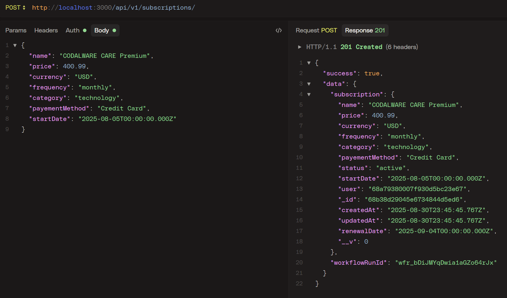

# Subscription Tracker API




#####


A Node.js REST API for managing user subscriptions, reminders, and authentication. Built with Express, MongoDB, Arcjet, Upstash QStash, and more.

# Folder Structure

```bash
APIV1/
├── app.js
├── package.json
├── README.md
├── .env.development.local
├── config/
│   ├── arcjet.js
│   ├── env.js
├── controllers/
│   ├── auth.controller.js
│   ├── user.controller.js
│   ├── subscription.controller.js
│   ├── workflow.controller.js
├── database/
│   └── mongodb.js
├── middlewares/
│   ├── arcjet.middleware.js
│   ├── auth.middleware.js
│   ├── error.middleware.js
├── models/
│   ├── auth.models.js
│   ├── subscription.models.js
│   ├── user.models.js
├── routes/
│   ├── auth.routes.js
│   ├── subscription.routes.js
│   ├── user.routes.js
│   ├── workflow.route.js
├── utils/
    └── send-email.js

```


## Running Workflow Locally

To run the Upstash QStash workflow locally:

1. Install the QStash CLI:
   ```bash
   npm install -g @upstash/qstash-cli
   ```

2. Start the QStash development server:
   ```bash
   npx @upstash/qstash-cli dev
   ```
   This will run QStash at `http://127.0.0.1:8080` and print your local token and signing keys.

3. Set your `.env.development.local` variables:
   - `QSTASH_TOKEN` (from the dev server output)
   - `QSTASH_URL=http://127.0.0.1:8080`

4. Make sure your workflow endpoint is accessible (e.g., `/api/v1/workflows/subscription/reminder`).

5. Trigger workflows using your API or the sample cURL command:
   ```bash
   curl -X POST http://127.0.0.1:8080/v2/publish/https://localhost:3000/api/v1/workflows/subscription/reminder -H "Authorization: Bearer <QSTASH_TOKEN>" -d '{"subscriptionID":"your_id_here"}'
   ```

---

- **Database:** Uses MongoDB Atlas (free tier recommended for deployment).
- **Email:** Configure SMTP credentials in `utils/send-email.js` for Nodemailer.
- **Security:** Arcjet middleware protects all routes from bots and abuse.
- **Workflows:** Upstash QStash handles scheduled reminders and background jobs.


## Features

- User authentication (JWT)
- Subscription CRUD operations
- Automated renewal reminders (workflow)
- Rate limiting and bot protection (Arcjet)
- Email notifications (Nodemailer)
- Environment-based configuration

## Tech Stack

- Node.js
- Express
- MongoDB (Mongoose)
- Arcjet (security)
- Upstash QStash (workflows)
- Nodemailer (email)
- Dayjs (date handling)

## Getting Started

### Prerequisites

- Node.js & npm
- MongoDB database

### Installation

1. Clone the repository:

   ```sh
   git clone https://github.com/danssou/APIV1.git
   cd APIV1
   ```

2. Install dependencies:

   ```sh
   npm install
   ```

3. Set up your `.env.development.local` file with required variables (see sample in repo).

4. Start the development server:

   ```sh
   npm run dev
   ```

### SOME API Endpoints

- `POST /api/v1/auth` — Auth
- `POST /api/v1/subscriptions` — Create... subscription
- `GET /api/v1/users/:id/subscriptions` — Get... user subscriptions
- `POST /api/v1/workflows/subscription/reminder` — Trigger reminder workflow

## Workflows & Reminders

- Uses Upstash QStash for scheduling reminders before subscription renewal dates.
- Arcjet protects all routes from bots and abuse.

## Email Notifications

- Nodemailer is used to send reminder emails to users.

## Environment Variables

See `.env.development.local` for required variables:

- `PORT`, `SERVER_URL`, `DB_URI`, `JWT_SECRET`, `ARCJET_KEY`, `QSTASH_TOKEN`, etc.

## Other

Feel free to contribute or open issues for improvements!
